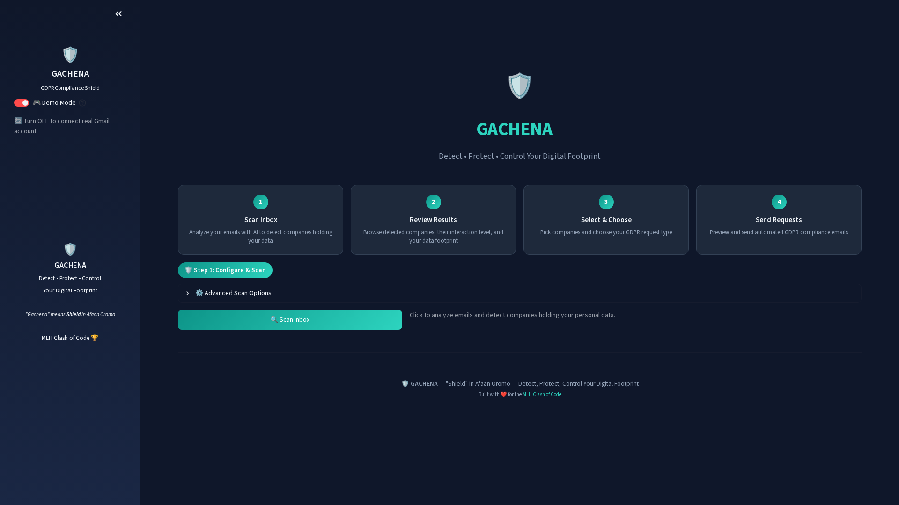
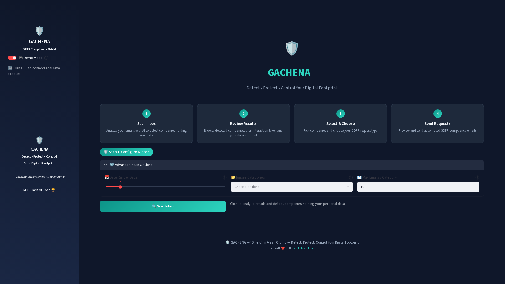
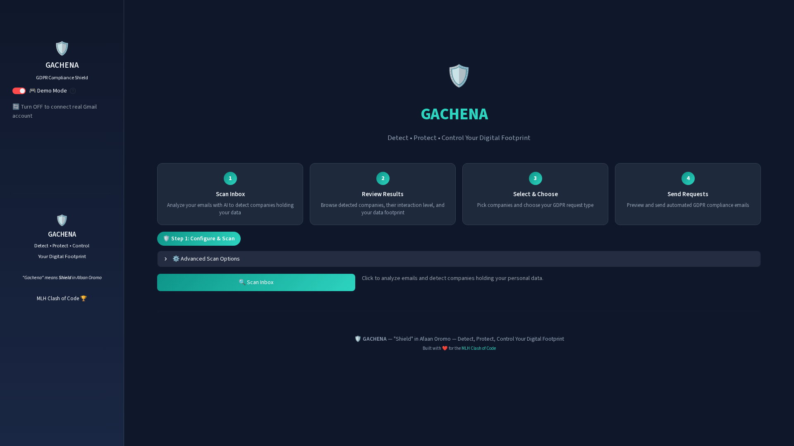
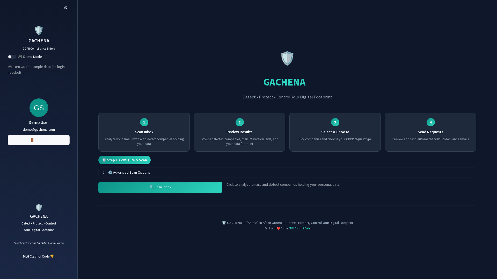
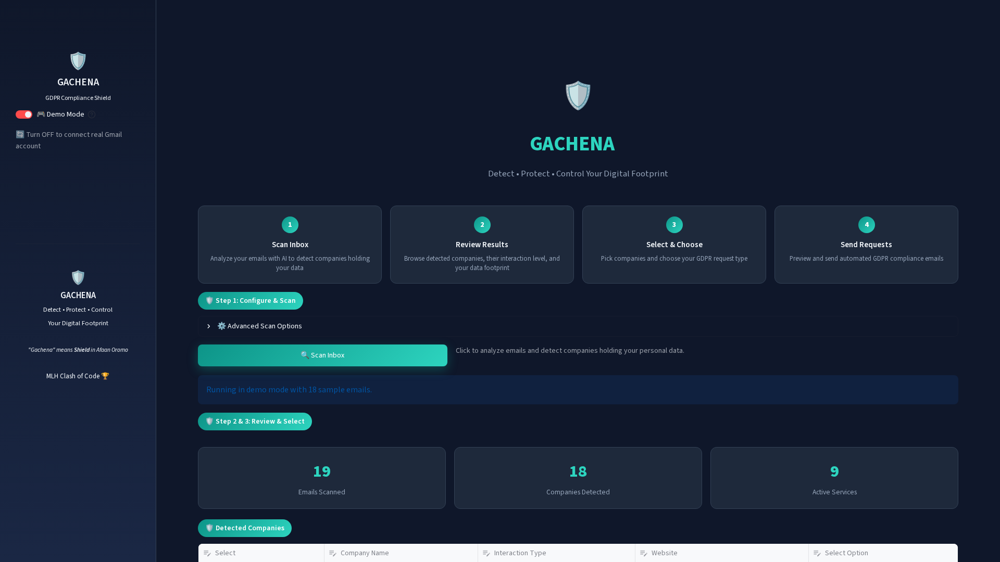
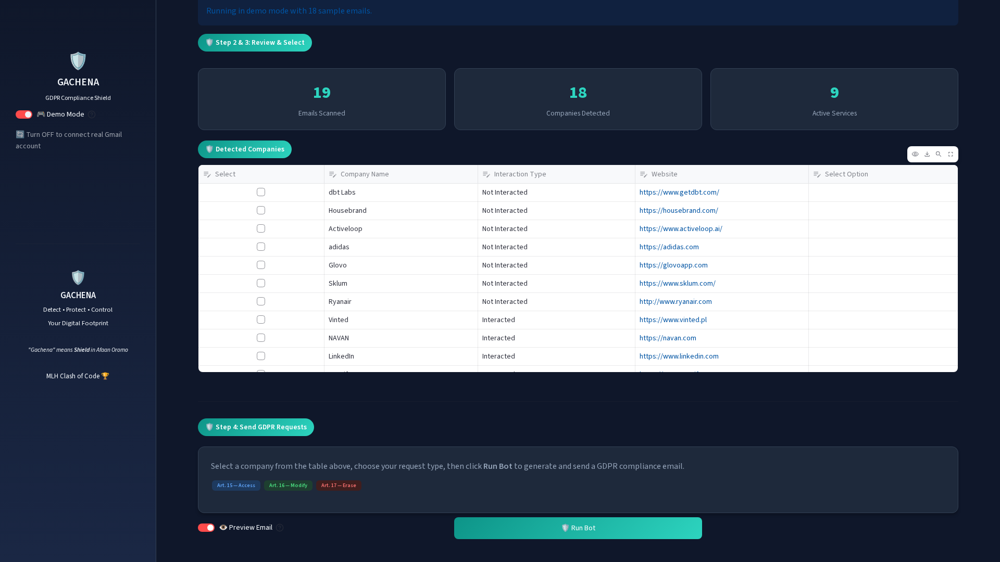
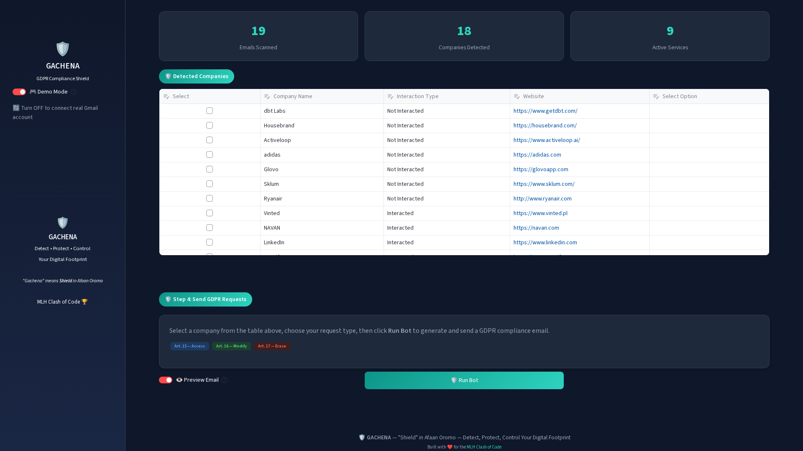
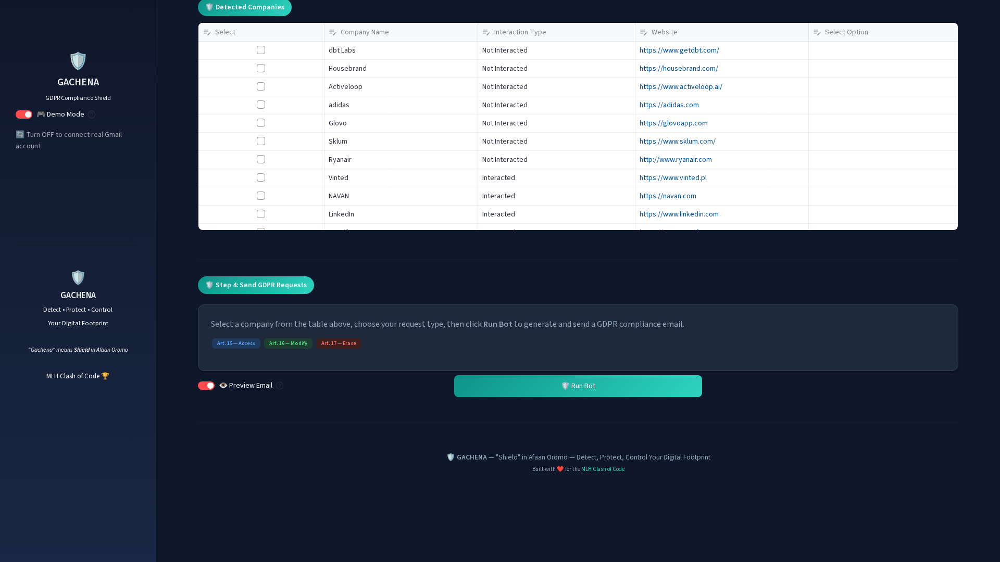

<div align="center">

# 🛡️ GACHENA

**Detect — Protect — Control Your Digital Footprint**

*Gachena* means **Shield** in [Afaan Oromo](https://en.wikipedia.org/wiki/Oromo_language) — because your data deserves armor.

[](https://www.python.org/downloads/)
[](https://streamlit.io/)
[](https://ai.google.dev/)
[](https://gdpr.eu/)
[](LICENSE)

[🌐 Live Demo](https://gachena-app.com) · [📖 Full Docs](docs/DOCUMENTATION.md)

</div>

---

## What is GACHENA?

**GACHENA** is an AI-powered GDPR compliance tool that automates the process of exercising your data privacy rights. Connect your Gmail, let Gemini AI scan your inbox to identify companies holding your personal data, and send professionally formatted GDPR requests (Access, Modify, or Erase) with a single click.

Built during the **[MLH Clash of Code Hackathon](https://events.mlh.io/events/13215-clash-of-code)**, GACHENA combines Google Gemini AI, FireCrawl web scraping, and the Gmail API into a sleek, privacy-first web application.

> **"Gachena"** — *Shield* in Afaan Oromo. Because your data deserves protection.

---

## ✨ Features

### 🤖 AI-Powered Email Analysis
- **Gemini 1.5 Flash** classifies every email by interaction type (active vs. marketing)
- Automatically extracts company names, websites, and engagement status
- Structured JSON output with retry logic for rate limits

### 🛡️ GDPR Compliance Automation
- **Article 15** — Right of Access: Request all data a company holds about you
- **Article 16** — Right to Rectification: Correct inaccurate personal data
- **Article 17** — Right to Erasure: Request permanent deletion of your data

### 📊 Interactive Dashboard
- Visual stat counters (emails scanned, companies detected, active services)
- Company logos grid powered by Logo.dev API
- Interactive data table with checkboxes and request type selection
- Real-time email preview before sending

### 🔐 Smart Authentication
- Google OAuth 2.0 with granular Gmail scopes
- JWT cookie-based persistent sessions
- **Demo Mode** — explore the full app with zero API keys

### 🔍 Privacy Policy Discovery
- FireCrawl integration maps company domains to find privacy policy pages
- AI extraction of GDPR contact emails from policy documents
- URL validation and email format verification

---

## 🎬 Demo Video

Watch the complete GACHENA workflow — from landing page to sending GDPR requests:

<a href="docs/gachena_demo.webm" target="_blank">
  
</a>

*The demo walks through every feature: authentication, inbox scanning, AI analysis, company selection, and GDPR email generation.*

---

## 📸 Step-by-Step Screenshots

### Step 1 — Landing Page

The welcome screen features an interactive particle network animation with the GACHENA shield branding. Enable **Demo Mode** in the sidebar to explore instantly — no credentials required.



---

### Step 2 — Dashboard

After authentication (automatic in Demo Mode), the dashboard presents your 4-step workflow at a glance: Scan → Review → Select → Send.



---

### Step 3 — Instruction Cards

Four visual step cards guide you through the entire GDPR compliance process, from scanning your inbox to sending automated requests.



---

### Step 4 — Advanced Scan Options

Customize your scan by adjusting the date range, excluding specific Gmail categories (Promotions, Social, Updates, Forums), and setting the maximum emails per category.



---

### Step 5 — Scan Results

After clicking **Scan Inbox**, GACHENA analyzes your emails with AI and displays summary statistics: total emails scanned, unique companies detected, and active services identified. Company logos are fetched via Logo.dev.



---

### Step 6 — Company Data Table

Every detected company is presented in an interactive table showing the company name, interaction type (Interacted / Not Interacted), and website. Each row has a checkbox for selection and a dropdown to choose your GDPR request type.



---

### Step 7 — Select & Choose

Check the companies you want to contact, then select your desired GDPR action from the dropdown: **Request Data** (Art. 15), **Modify Data** (Art. 16), or **Erase Data** (Art. 17).



---

### Step 8 — Run Bot & Send

Click **Run Bot** to generate your GDPR compliance email. With **Preview Email** enabled, review the full email before sending. The email is professionally formatted and addresses the company's Data Protection Officer, citing the relevant GDPR article.



---

## 🚀 Quick Start

### Demo Mode (No API Keys Needed)

```bash
# 1. Clone the repository
git clone https://github.com/Hope0351/Clash-Code.git
cd Clash-Code

# 2. Install dependencies
pip install streamlit pandas requests python-dotenv pyjwt extra-streamlit-components

# 3. Run the app
streamlit run app.py
```

Open **http://localhost:8501** — Demo Mode is ON by default. Click **Scan Inbox** to load 18 sample emails and detect 13 companies instantly.

### Live Mode (Full Gmail Integration)

For real Gmail scanning and email sending, you'll need:

1. **Google Cloud Project** with:
   - Gmail API enabled
   - Vertex AI API enabled
   - OAuth 2.0 credentials → save as `credentials.json`
   - Service account key → save as `service_acc.json`

2. **API Keys**:
   - [FireCrawl](https://firecrawl.dev) — privacy policy discovery
   - [Logo.dev](https://logo.dev) — company logos (optional)

3. **Configure environment**:
```bash
cp .env.example .env
# Edit .env with your API keys
```

4. **Install full dependencies and run**:
```bash
pip install -r requirements.txt
streamlit run app.py
# Toggle Demo Mode OFF in the sidebar
```

---

## ⚙️ Configuration

All secrets are loaded from environment variables (`.env` file). See [`.env.example`](.env.example) for the full template.

| Variable | Required | Default | Description |
|----------|----------|---------|-------------|
| `FIRECRAWL_API_KEY` | Live mode | — | FireCrawl API key for privacy policy discovery |
| `LOGODEV_API_KEY` | Optional | — | Logo.dev API key for company logo display |
| `VERTEX_PROJECT` | Live mode | — | Your GCP project ID |
| `SERVICE_ACCOUNT_PATH` | Live mode | `service_acc.json` | Vertex AI service account key path |
| `COOKIE_KEY` | Production | `change_me_in_production` | JWT signing secret |
| `GEMINI_MODEL` | No | `gemini-1.5-flash-001` | Vertex AI model name |
| `MAX_GEMINI_RETRIES` | No | `3` | Max retries on rate limit (429) |
| `GEMINI_RETRY_DELAY` | No | `60` | Seconds between retry attempts |
| `COOKIE_EXPIRY_DAYS` | No | `30` | Session cookie lifetime in days |

---

## 🐳 Docker Deployment

```bash
# Build
docker build -t gachena-app .

# Run
docker run -p 8501:8080 \
  -v $(pwd)/credentials.json:/app/credentials.json:ro \
  -v $(pwd)/service_acc.json:/app/service_acc.json:ro \
  -e FIRECRAWL_API_KEY=your_key \
  -e LOGODEV_API_KEY=your_key \
  -e VERTEX_PROJECT=your-project \
  -e COOKIE_KEY=your_random_secret \
  gachena-app
```

### Docker Compose

```yaml
version: '3.8'
services:
  gachena:
    build: .
    ports:
      - "8501:8080"
    volumes:
      - ./credentials.json:/app/credentials.json:ro
      - ./service_acc.json:/app/service_acc.json:ro
    environment:
      - FIRECRAWL_API_KEY=${FIRECRAWL_API_KEY}
      - LOGODEV_API_KEY=${LOGODEV_API_KEY}
      - VERTEX_PROJECT=${VERTEX_PROJECT}
      - COOKIE_KEY=${COOKIE_KEY}
    restart: unless-stopped
```

---

## 🏗️ Architecture

```
┌──────────────────────────────────────────────────────────┐
│                   Streamlit Frontend                      │
│  ┌──────────┐  ┌──────────┐  ┌──────────┐  ┌──────────┐ │
│  │ Landing  │  │ Dashboard│  │  Data    │  │  Email   │ │
│  │ Page     │  │ + Stats  │  │  Table   │  │  Preview │ │
│  │(particles)│  │(4 steps)│  │(editor)  │  │(dialog)  │ │
│  └──────────┘  └──────────┘  └──────────┘  └──────────┘ │
└────────────────────────┬─────────────────────────────────┘
                         │
┌────────────────────────┴─────────────────────────────────┐
│                      app.py (Entry)                       │
│  Page config · Demo mode toggle · Auth routing · Scan    │
└────────────────────────┬─────────────────────────────────┘
                         │
┌────────────────────────┴─────────────────────────────────┐
│                  utils.py (Business Logic)                │
│  ┌──────────┐ ┌──────────┐ ┌──────────┐ ┌──────────┐    │
│  │  Gmail   │ │  Gemini  │ │ FireCrawl│ │ Logo.dev │    │
│  │  API     │ │  AI      │ │  Scrape  │ │  Logos   │    │
│  └──────────┘ └──────────┘ └──────────┘ └──────────┘    │
└──────────────────────────────────────────────────────────┘
         │              │               │             │
    Gmail API    Vertex AI      FireCrawl API    Logo.dev API
```

### Key Design Decisions

- **Lazy Import System**: Heavy dependencies (Vertex AI, Gmail API) are only loaded in live mode. Demo mode needs only `streamlit`, `pandas`, and `requests`.
- **Demo Mode Bypass**: The demo toggle is rendered **before** authentication, creating a mock session that skips the entire OAuth flow.
- **Graceful Degradation**: Missing `credentials.json` shows a clear warning instead of crashing.
- **No Data Storage**: Emails are processed in memory — nothing is persisted to disk.

---

## 📁 Project Structure

```
Clash-Code/
├── app.py                      # Main Streamlit application (GACHENA UI)
├── utils.py                    # Core logic: AI, Gmail, data processing
├── streamlit_auth.py           # Google OAuth 2.0 authentication
├── streamlit_auth_cookie.py    # JWT cookie session management
├── index.html                  # Landing page (particles.js animation)
├── gemini_processed_emails.json # Sample data for demo mode (18 emails)
├── requirements.txt            # Python dependencies
├── Dockerfile                  # Container config (non-root user, dark theme)
├── .env.example                # Environment variable template
├── .gitignore                  # Git exclusions (secrets)
├── .dockerignore               # Docker build exclusions
├── docs/
│   ├── DOCUMENTATION.md        # Full technical documentation
│   ├── gachena_demo.webm       # 5-minute demo video
│   └── screenshots/
│       ├── 01_landing_page.png
│       ├── 02_demo_dashboard.png
│       ├── 03_instruction_cards.png
│       ├── 04_advanced_options.png
│       ├── 05_scan_results.png
│       ├── 06_data_table.png
│       ├── 07_company_selection.png
│       └── 08_bot_controls.png
└── LICENSE                     # MIT License
```

---

## 🔒 Security & Privacy

- **No Data Storage**: All processing happens in memory — nothing is written to disk
- **End-to-End Encryption**: All API communications use HTTPS
- **Minimal Permissions**: Only requested Gmail scopes are accessed
- **Session Isolation**: User data is never shared between sessions
- **Configurable Secrets**: All keys loaded from environment variables
- **Non-Root Container**: Docker runs as `appuser`, not root

---

## 👥 Team

**GACHENA** was built by a team of three during the MLH Clash of Code hackathon:

- **Abdi Megersa** — Backend & AI Integration
- **Eba Alemu** — Frontend & UI Design
- **Osama Hasan** — DevOps & Deployment

---

## 📄 License

This project is licensed under the **MIT License** — see the [LICENSE](LICENSE) file for details.

---

<div align="center">

**GACHENA** 🛡️ — *Shield* in Afaan Oromo

Detect · Protect · Control Your Digital Footprint

Built with ❤️ for the [MLH Clash of Code](https://events.mlh.io/events/13215-clash-of-code)

[](https://github.com/Hope0351/Clash-Code)

</div>