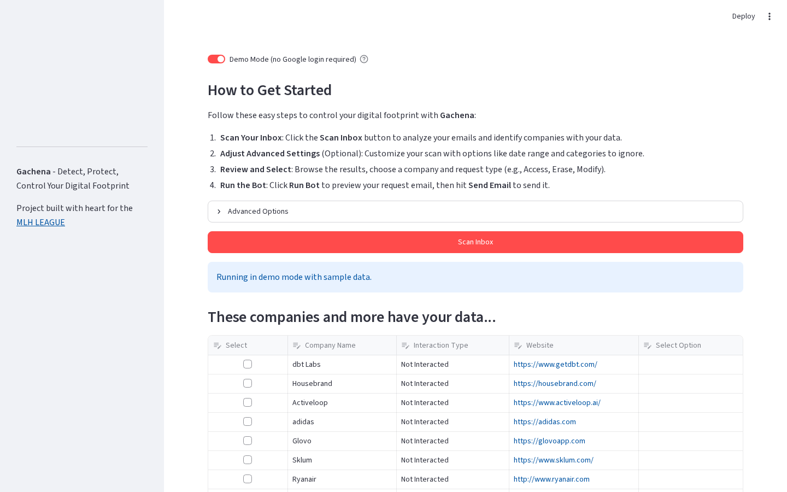
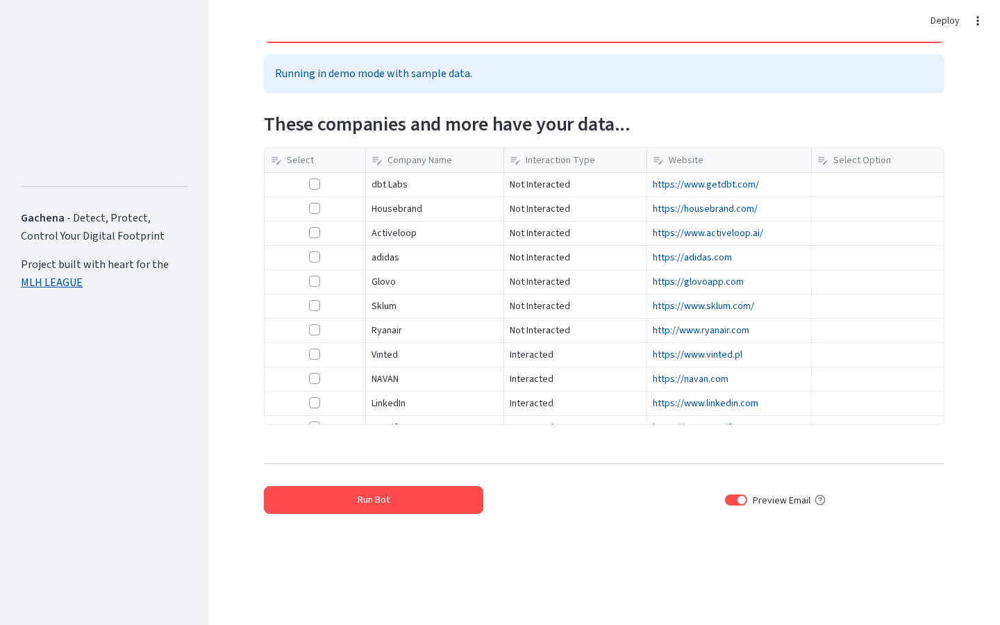
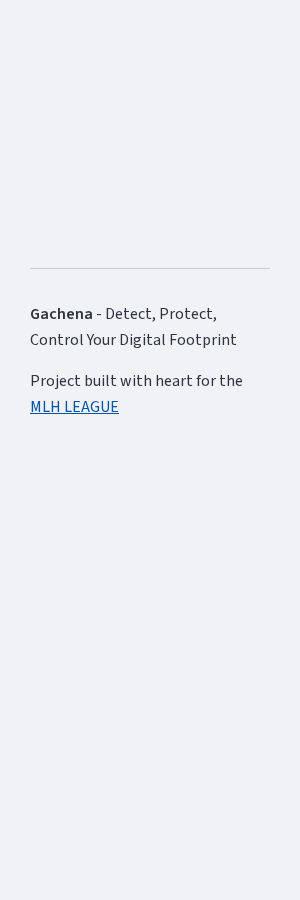
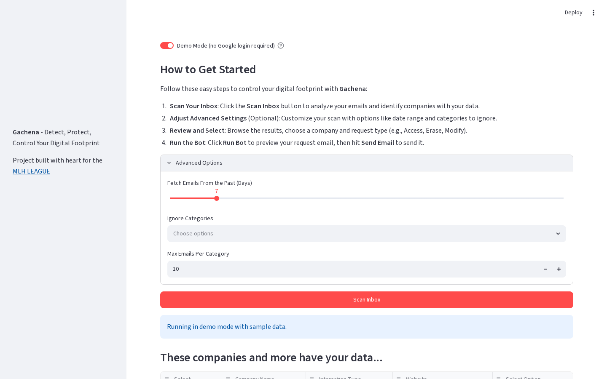
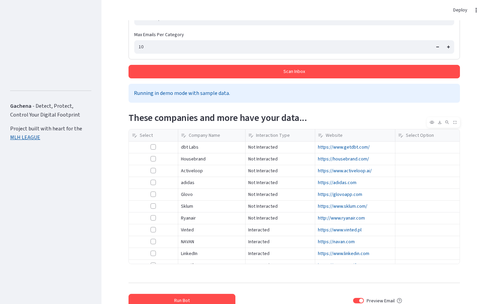

# GACHENA - MLH Hackathon
**Detect - Protect - Control Your Digital Footprint**

## Demo & Resources

### Live Demo
- **Application**: [https://gachena-app.com](https://gachena-app.com/)
- **Demo Video**: [Watch on YouTube](https://youtu.be/JzglW8pOG2s)

### Presentation Materials
- **Pitch Deck**: [CANVA](https://www.canva.com/design/DAG-A8hVKxA/bbe7FO5dtep7RjiMZYB6oQ/edit)

**Gachena** is an innovative web application that empowers users to take control of their personal data by automating GDPR compliance requests. Connect your Gmail, scan your digital footprint, and send automated data privacy requests to companies holding your information.

## Screenshots

### Landing Page
The welcome screen with an interactive particle animation greets users before they sign in. Demo mode is enabled by default so you can explore without any API keys.


### Scan Results
After clicking "Scan Inbox" in demo mode, the app loads 18 sample emails and identifies 13 unique companies that have your data. Each company is classified as "Interacted" or "Not Interacted" based on AI analysis.



### Company Data Table
Detected companies are displayed in an interactive table. Select companies using checkboxes and choose a request type: Request Data (Article 15), Modify Data (Article 16), or Erase Data (Article 17).



### Sidebar
The sidebar shows user profile information, the demo mode toggle, and provides quick access to log out.



### Advanced Options
Customize your scan with date range, category filters, and max emails per category. These options apply to live Gmail scanning mode.



### Run Bot
Once companies are selected, click "Run Bot" to preview and send GDPR compliance emails. Enable "Preview Email" to review before sending (single selection), or disable it for bulk send.



## Features

### Smart Authentication
- **Google OAuth Integration**: Secure login with Gmail account
- **Granular Permission Scopes**: Access only to Gmail read/send capabilities
- **Session Management**: Persistent login with cookie-based authentication
- **Demo Mode**: Explore the full app without any credentials or API keys

### AI-Powered Analysis
- **Email Intelligence**: Gemini AI analyzes email content to identify companies and interaction types
- **Company Detection**: Automatically extracts company names and websites from emails
- **Privacy Policy Discovery**: FireCrawl integration finds privacy policy pages from company domains
- **GDPR Contact Extraction**: AI extracts GDPR-specific email addresses from privacy policies

### Interactive Dashboard
- **Visual Data Table**: Review all detected companies with logos and categorization
- **Advanced Filtering**: Customize date ranges and exclude email categories
- **Selection Interface**: Choose companies and request types with checkboxes
- **Real-time Preview**: Preview GDPR emails before sending

### Automated Compliance
- **Dynamic Templates**: Customizable GDPR request templates (Access, Erase, Modify)
- **Bulk Operations**: Send requests to multiple companies simultaneously
- **Email Validation**: Verify extracted email addresses before sending
- **Send Logs**: Track all sent requests with timestamps

## Tech Stack

### Backend & AI
- **Python 3.12+**: Core application logic
- **Google Gemini 1.5 Flash**: AI-powered email and document analysis
- **Vertex AI Integration**: Cloud-based AI model hosting
- **Google Gmail API**: Email reading and sending capabilities
- **FireCrawl**: Web scraping for privacy policy discovery

### Frontend & UI
- **Streamlit**: Interactive web application framework
- **Pandas**: Data manipulation and table display
- **HTML/CSS**: Custom landing page with particles.js animation

### Authentication & Security
- **Google OAuth 2.0**: Secure user authentication
- **JWT Tokens**: Session management and security (configurable secret key)
- **Cookie-based Auth**: Persistent user sessions

### Deployment & DevOps
- **Docker**: Containerized application (non-root user)
- **Google Cloud Run**: Serverless deployment platform
- **Environment Variables**: Secure configuration management via `.env`

## Quick Start

### Prerequisites
- Python 3.12 or higher
- pip (Python package manager)

### Demo Mode (No API Keys Needed)

1. **Clone the repository**
```bash
git clone https://github.com/Hope0351/Clash-Code.git
cd Clash-Code
```

2. **Install dependencies**
```bash
pip install -r requirements.txt
```

3. **Run the application**
```bash
streamlit run app.py
```

4. **Open your browser** and navigate to `http://localhost:8501`

Demo mode is enabled by default. You'll see a demo user profile and can click "Scan Inbox" to load sample data immediately. No Google credentials, API keys, or configuration needed.

### Live Mode (With Gmail)

For full functionality with real Gmail scanning, you'll need:

1. **Google Cloud Project** with:
   - Gmail API enabled
   - Vertex AI API enabled
   - OAuth 2.0 credentials (download as `credentials.json`)
   - Service account key (download as `service_acc.json`)

2. **API Keys**:
   - [FireCrawl](https://firecrawl.dev) - for privacy policy discovery
   - [Logo.dev](https://logo.dev) - for company logo retrieval

3. **Configure environment**:
```bash
cp .env.example .env
# Edit .env with your actual keys
```

4. **Run** with demo mode toggled off:
```bash
streamlit run app.py
```

## Usage Guide

### Step 1: Authenticate
- **Demo Mode**: Automatically logged in as "Demo User" - no action needed
- **Live Mode**: Click "Sign in with Google" in the sidebar and grant permissions

### Step 2: Scan Your Inbox
- Click **Scan Inbox** to analyze recent emails
- In demo mode, 18 pre-loaded sample emails are processed instantly
- In live mode, emails are fetched from your Gmail and analyzed by Gemini AI
- Adjust date range and filters in "Advanced Options"

### Step 3: Select Companies
- Browse the interactive table of detected companies
- Select companies using checkboxes in the leftmost column
- Choose request type for each: Request Data, Erase Data, or Modify Data

### Step 4: Send Requests
- Click **Run Bot** to process your selections
- Enable **Preview Email** to review before sending (single selection only)
- Disable preview for bulk send to multiple companies
- In demo mode, preview works but actual sending is disabled

## Configuration

### Environment Variables

See [`.env.example`](.env.example) for the full list of configurable options:

| Variable | Required | Default | Description |
|----------|----------|---------|-------------|
| `FIRECRAWL_API_KEY` | Live mode | - | FireCrawl API key for privacy policy discovery |
| `LOGODEV_API_KEY` | Optional | - | Logo.dev API key for company logos |
| `SERVICE_ACCOUNT_PATH` | Live mode | `service_acc.json` | Path to Vertex AI service account JSON |
| `VERTEX_PROJECT` | Live mode | - | Your GCP project ID |
| `COOKIE_KEY` | Production | `change_me_in_production` | JWT signing secret |
| `GOOGLE_REDIRECT_URI` | No | `http://localhost:8501/` | OAuth redirect URI |
| `GEMINI_MODEL` | No | `gemini-1.5-flash-001` | Vertex AI model name |
| `MAX_GEMINI_RETRIES` | No | `3` | Max retries on rate limit (429) |
| `GEMINI_RETRY_DELAY` | No | `60` | Base delay in seconds between retries |
| `COOKIE_EXPIRY_DAYS` | No | `30` | Days until auth cookie expires |

## Docker Deployment

### Build Docker Image
```bash
docker build -t gachena-app .
```

### Run Container
```bash
docker run -p 8501:8080 \
  -v $(pwd)/credentials.json:/app/credentials.json:ro \
  -v $(pwd)/service_acc.json:/app/service_acc.json:ro \
  -e FIRECRAWL_API_KEY=your_key \
  -e LOGODEV_API_KEY=your_key \
  -e VERTEX_PROJECT=your-project \
  -e COOKIE_KEY=your_random_secret \
  gachena-app
```

### Docker Compose
```yaml
version: '3.8'
services:
  gachena:
    build: .
    ports:
      - "8501:8080"
    volumes:
      - ./credentials.json:/app/credentials.json:ro
      - ./service_acc.json:/app/service_acc.json:ro
    environment:
      - FIRECRAWL_API_KEY=${FIRECRAWL_API_KEY}
      - LOGODEV_API_KEY=${LOGODEV_API_KEY}
      - VERTEX_PROJECT=${VERTEX_PROJECT}
      - COOKIE_KEY=${COOKIE_KEY}
    restart: unless-stopped
```

## Project Structure

```
Clash-Code/
├── app.py                      # Main Streamlit application
├── utils.py                    # Core business logic, AI, Gmail API (lazy imports)
├── streamlit_auth.py           # Google OAuth authentication module
├── streamlit_auth_cookie.py    # JWT cookie session management
├── requirements.txt            # Pinned Python dependencies
├── Dockerfile                  # Container config (non-root user)
├── .dockerignore               # Docker build exclusions
├── .gitignore                  # Git exclusions (secrets)
├── .env.example                # Environment variable template
├── index.html                  # Landing page (particles.js animation)
├── gemini_processed_emails.json # Sample email data for demo mode
├── docs/
│   └── screenshots/            # Application screenshots
│       ├── 01_landing_page.png
│       ├── 02_scan_results.png
│       ├── 03_data_table.png
│       ├── 04_sidebar.png
│       ├── 05_advanced_options.png
│       └── 06_run_bot.png
├── LICENSE                     # MIT License
└── README.md                   # This file
```

## Architecture

The application follows a modular architecture designed for both demo and production use:

- **Lazy Import System**: Heavy dependencies (Vertex AI, Gmail API, etc.) are only imported when actually needed in live mode. Demo mode requires only `streamlit`, `pandas`, and `requests`.
- **Demo Mode Bypass**: When demo mode is active, the entire OAuth flow is skipped and a mock user session is created. Data is loaded from a local JSON file instead of Gmail.
- **Fragment-Free Rendering**: The UI uses standard Streamlit components without `@st.fragment` decorators to ensure reliable rendering across all Streamlit versions.
- **Graceful Degradation**: If `credentials.json` is missing, the app shows a clear message instead of crashing.

## Security & Privacy

### Data Protection
- **No Data Storage**: Emails are processed in memory, not stored
- **End-to-End Encryption**: All API communications use HTTPS
- **Minimal Permissions**: Only requested Gmail scopes are accessed
- **Session Isolation**: User data is never shared between sessions
- **Configurable Secrets**: All sensitive keys loaded from environment variables

### Compliance
- **GDPR Compliant**: Helps users exercise GDPR rights (Articles 15, 16, 17)
- **Transparent Operations**: Clear indication of all actions taken
- **User Consent**: Explicit permission for each email scan
- **Right to Revoke**: Users can disconnect access at any time

## Contributing

We welcome contributions! Here's how:

1. **Fork the repository**
2. **Create a feature branch**
```bash
git checkout -b feature/amazing-feature
```
3. **Commit your changes**
```bash
git commit -m 'Add amazing feature'
```
4. **Push to the branch**
```bash
git push origin feature/amazing-feature
```
5. **Open a Pull Request**

## Team

**Gachena** was developed by a team of three during the MLH Hackathon:
- **Abdi Megersa** - Backend & AI Integration
- **Eba Alemu** - Frontend & UI Design
- **Osama Hasan** - DevOps & Deployment

## Support

For issues, questions, or support:
- **GitHub Issues**: [Create an issue](https://github.com/Hope0351/Clash-Code/issues)

## Acknowledgements

- **MLH Hackathon** for the opportunity and platform
- **Google Cloud** for AI and infrastructure services
- **Streamlit** for the amazing framework
- **FireCrawl & Logo.dev** for their APIs
- All open-source contributors whose work made this possible

---

<div align="center">

**Gachena** - Detect, Protect, Control Your Digital Footprint

[](https://github.com/Hope0351/Clash-Code)
[](https://www.python.org/downloads/)

*Built with heart during MLH Hackathon*

</div>